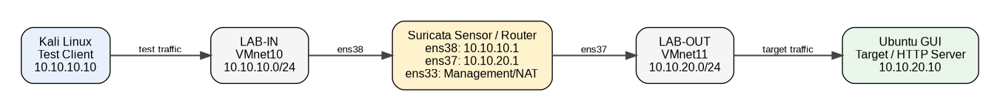

# Suricata IDS/IPS Security Monitoring & SOC Lab

A practical SOC lab built with **Suricata 7.0.3**, VMware Workstation, Kali Linux, and Ubuntu GUI. The lab demonstrates a complete workflow:

**Traffic → Detection → Alert → Investigation → Evidence → Incident Report**

> Current implementation is **IDS mode**. Alerts show `action: allowed`; no inline IPS blocking policy is enabled in this lab.

## Lab Architecture

```text
Kali / Test Client
10.10.10.10
      |
   LAB-IN
10.10.10.0/24
      |
Suricata Sensor / Router
  ens38 = 10.10.10.1
  ens37 = 10.10.20.1
  ens33 = Management/NAT
      |
   LAB-OUT
10.10.20.0/24
      |
Ubuntu GUI / Target
10.10.20.10
```



## Detection Scenarios

| ID | Scenario | Signature | Evidence |
|---|---|---|---|
| INC-001 | ICMP reconnaissance/test traffic | `1000001` | fast.log + eve.json |
| INC-002 | TCP SYN port scan | `1000002` | fast.log + eve.json |
| INC-003 | Suspicious HTTP `/admin` request | `1000003` | fast.log + eve.json |

## Custom Rules

```text
alert icmp any any -> any any (msg:"SOC LAB ICMP Test"; sid:1000001; rev:1;)
alert tcp any any -> any any (flags:S; msg:"SOC LAB Possible TCP SYN Scan"; threshold:type threshold, track by_src, count 10, seconds 5; sid:1000002; rev:1;)
alert http any any -> any any (http.uri; content:"/admin"; msg:"SOC LAB Suspicious HTTP URI"; sid:1000003; rev:1;)
```

Rules are stored in `rules/custom-rules.md`.

## Key Evidence

- `09-eve-json-alert.png` — ICMP EVE JSON alert
- `10-port-scan-detection.png` — TCP SYN scan alerts
- `11-suspicious-http-detection.png` — HTTP `/admin` detection
- `12-incident-001-evidence.png` — ICMP incident evidence
- `13-incident-002-evidence.png` — port scan incident evidence
- `14-incident-003-evidence.png` — suspicious HTTP incident evidence

Screenshots `01–08` were created during the lab but their individual source files were not available in the final chat workspace, so they are not fabricated here. Copy the original files into `screenshots/` before publishing if you want the full 01–15 screenshot sequence.

## Validation Commands

Test Suricata configuration:

```bash
sudo suricata -T -c /etc/suricata/suricata.yaml
```

Run the sensor in the lab:

```bash
sudo suricata -i ens38 -c /etc/suricata/suricata.yaml
```

Review fast alerts:

```bash
sudo tail -n 20 /var/log/suricata/fast.log
```

Review EVE alerts:

```bash
sudo grep '"event_type":"alert"' /var/log/suricata/eve.json | tail -n 20
```

## Repository Structure

```text
suricata-soc-lab/
├── README.md
├── architecture/
│   └── architecture.png
├── deployment/
│   ├── suricata.md
│   └── lab-machines.md
├── rules/
│   └── custom-rules.md
├── detections/
│   ├── reconnaissance.md
│   ├── port-scan.md
│   └── suspicious-http.md
├── incidents/
│   ├── INC-001.md
│   ├── INC-002.md
│   └── INC-003.md
├── screenshots/
├── docs/
│   └── lessons-learned.md
└── .gitignore
```

## Scope & Safety

All traffic generation was performed inside an isolated VMware lab using systems owned/controlled by the lab operator. The Nmap scan and HTTP request are controlled validation tests, not attacks against third-party systems.
